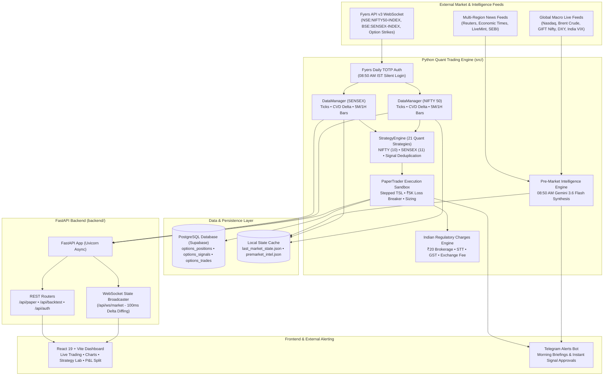
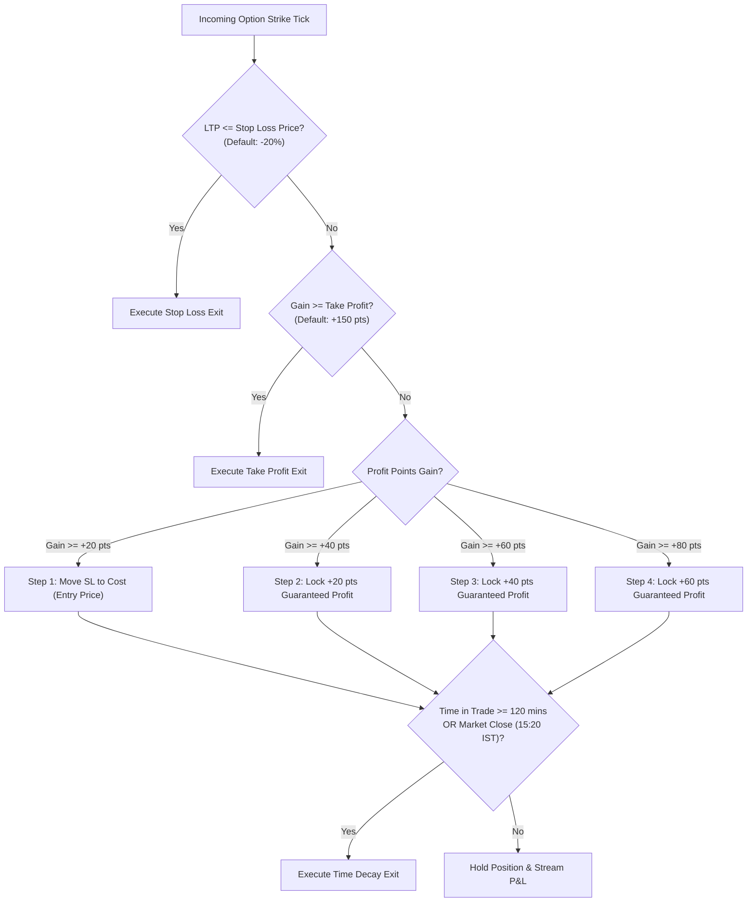

# OptionsSimulator — Complete End-to-End System Architecture

**High-Frequency Options Paper-Trading, Backtesting & AI Market Intelligence Platform for NIFTY 50 & SENSEX Index Derivatives**

---

## 1. System Overview & Core Philosophy

OptionsSimulator is an institutional-grade, real-time algorithmic options trading simulation and analytics engine designed specifically for the Indian equity derivatives markets (**NSE NIFTY 50** & **BSE SENSEX**). 

The platform bridges real-world market microstructure with simulated execution:
- **Zero Real-Order Risk:** Executes 100% in a deterministic, sub-second paper-trading execution sandbox with realistic slippage, liquidity modeling, and Indian statutory tax deductions.
- **Microstructure Fidelity:** Processes sub-second live ticks via Fyers WebSocket feeds, reconstructs 1-minute and 5-minute OHLCV candles, computes tick-level Cumulative Volume Delta (CVD), and caches real-time Option Chains.
- **Dual-Index Multi-Strategy Engine:** Evaluates **21 quantitative algorithmic strategies** concurrently (10 NIFTY + 11 SENSEX) across 5-minute In-The-Money (ITM) trend continuations and 1-minute At-The-Money (ATM) high-speed scalping.
- **Stepped Trailing Stop Loss (TSL):** Features institutional dynamic profit protection with 20–30 point stepping intervals to maximize risk-reward and lock intraday profits.
- **08:50 AM Pre-Market Catalyst AI:** Ingests live global financial quotes (Nasdaq, Brent Crude, GIFT Nifty, DXY, India VIX) and multi-region newspaper feeds into Google Gemini 3.6 Flash for morning opening sector bias and strategy conviction briefings.
- **Full-Stack Glassmorphic UI:** Modern React 19 frontend with TradingView-grade EMA overlays, CVD delta charts, weekend LTP persistence, and interactive Strategy Lab backtesting sandboxes.

---

## 2. High-Level System Architecture Diagram



---

## 3. Technology Stack

| Layer | Technology | Purpose & Implementation Details |
| :--- | :--- | :--- |
| **Trading Core** | Python 3.11+ | High-throughput asynchronous math, indicator computation, and simulated order execution. |
| **Market Data** | Fyers API v3 | Silent automated TOTP authentication, sub-second binary WebSocket data stream, and REST Option Chain polling. |
| **Global Macro** | Native HTTP / Python stdlib | Built-in zero-dependency financial ticker engine fetching Nasdaq, Brent Crude, DXY, VIX, and GIFT Nifty. |
| **AI Intelligence**| Google Gemini 3.6 Flash | Ingests multi-region financial news feeds and macro tickers to synthesize opening market bias at 08:50 AM IST. |
| **Web Backend** | FastAPI + Uvicorn | High-concurrency async ASGI web server serving REST endpoints and low-latency WebSocket diff broadcasts. |
| **Database** | PostgreSQL (Supabase) | `asyncpg` connection pool managing ACID-compliant persistent position state, trade logs, and signal audit trails. |
| **Frontend UI** | React 19 + Vite + Tailwind CSS | Ultra-responsive dark-mode glassmorphic UI with Lucide icons, Framer Motion animations, and Lightweight-Charts. |
| **Alerting** | Telegram Bot API | Bidirectional mobile notification layer sending pre-market briefings and interactive trade approval prompts. |
| **Deployment** | Ubuntu Linux VM + Systemd + Nginx | Production VM hosting backend on port 8001, reverse-proxied via Nginx with automated GitHub Actions CI/CD. |

---

## 4. End-to-End Lifecycle: From 08:50 AM Login to Trade Exit

### Step 1: Automated Daily Authentication (08:50 AM IST)
- At **08:50 AM IST** every trading morning, `LiveTrader.ensure_connection_state()` triggers `FyersAPIClient.refresh_access_token()`.
- Utilizes `pyotp` to generate a 6-digit TOTP token, silently authenticates against Fyers OAuth2 endpoints without human intervention, and caches the daily bearer token.
- Automatically warms up indicators by fetching 10 days of historical 1-minute candles for both **NIFTY 50** (`NSE:NIFTY50-INDEX`) and **SENSEX** (`BSE:SENSEX-INDEX`).

### Step 2: 08:50 AM Pre-Market Catalyst AI Briefing
1. `backend/app/ai_intelligence.py` concurrently queries:
   - **Live Global Tickers:** Nasdaq (`^IXIC`), Brent Crude (`BZ=F`), India VIX (`^INDIAVIX`), DXY (`DX-Y.NYB`), and GIFT Nifty Futures (`NIFTY1!`).
   - **Multi-Region Newspaper RSS Feeds:** Reuters, *The Economic Times*, *LiveMint*, and SEBI corporate announcements.
2. Mathematically calculates expected opening gap:  
   $$\text{Expected Gap} = \text{GIFT Nifty Futures} - \text{NIFTY 50 Previous Close}$$
3. Feeds verified live data and categorized news headlines into **Google Gemini 3.6 Flash**.
4. Dispatches morning executive intelligence report to the user's **Telegram Bot** and updates the dashboard's **Pre-Market Intelligence Card**.

### Step 3: Market Open & Tick Processing (09:15 AM IST)
- Fyers WebSocket feed connects and subscribes to index and strike quotes.
- `DataManager.on_nifty_tick()` demultiplexes incoming ticks:
  - Updates Last Traded Price (LTP).
  - Calculates tick-by-tick signed **Volume Delta**:
    $$\Delta V = \begin{cases} +V & \text{if } P_t > P_{t-1} \\ -V & \text{if } P_t < P_{t-1} \\ 0 & \text{if } P_t = P_{t-1} \end{cases}$$
  - Aggregates sub-second ticks into 1-minute and 5-minute OHLCV candles.
  - Updates technical indicators: EMA (9, 20, 50), RSI (14), MACD (12, 26, 9), Stochastic Oscillator, ATR (14), and Volatility Regime Ratio.

### Step 4: Quantitative Strategy Evaluation
- Every tick cycle, `StrategyEngine.evaluate_all()` scans all **21 algorithmic strategies**:
  - **10 NIFTY Strategies:** ORB 5M Breakout, EMA 20 Bounce, MACD 15M Trend, Support Bounce, Resistance Rejection, Heikin-Ashi Trend Continuation, 1M ATM Scalper.
  - **11 SENSEX Strategies:** ORB 5M ITM Breakout, Support/Resistance Bounce, Stochastic Oversold Scalper, 1M ATM Momentum.
- When an entry condition is met, the strategy generates an institutional `Signal`:
  - **Dynamic Strike Selection:** Selects In-The-Money (ITM) strike (e.g. Spot 24,250 $\rightarrow$ 24,200 CE / 24,300 PE) with At-The-Money (ATM) fallback.
  - **Signal Deduplication:** Enforces per-strategy cooldown timers and maximum trade limits per day.

### Step 5: Simulated Order Execution (PaperTrader)
- In `auto_mode` (default), the order is approved instantly within **<5 milliseconds**.
- `PaperTrader.place_order()` enforces pre-trade risk checks:
  1. **Daily Loss Circuit Breaker:** Rejects orders if day's net loss exceeds ₹5,000.
  2. **Max Concurrent Positions:** Restricts open portfolio positions to 5 active trades.
  3. **Consecutive Loss Cooldown:** Halts strategy for the day if 2 consecutive losses occur.
- Fills simulated position at current ask/bid price with realistic slippage modeling and persists order to Supabase PostgreSQL (`options_positions`).

### Step 6: Dynamic Stepped Trailing Stop Loss & Exit Engine
Once open, the position is monitored every sub-second tick against multiple exit criteria:



### Step 7: Statutory Tax & Charges Calculation
Upon trade exit, `src/utils/charges.py` calculates itemized Indian regulatory deductions:
- **Brokerage:** Flat ₹20 per executed order (₹40 round-trip).
- **Securities Transaction Tax (STT):** 0.10% on option sell premium turnover.
- **Exchange Turnover Fee:** 0.03503% on NSE / 0.0325% on BSE turnover.
- **Goods & Services Tax (GST):** 18% on (Brokerage + Exchange Turnover Fee).
- **Stamp Duty:** 0.003% on buy turnover.
- **SEBI Turnover Charges:** ₹10 per crore turnover.
- Computes **Gross P&L**, **Total Regulatory Deductions**, and **Net P&L**, archiving trade to `options_trades`.

---

## 5. Algorithmic Strategy Matrix (21 Strategies)

| Index | Strategy Name | Timeframe | Strike Mode | Primary Technical Trigger | Exit Logic |
| :--- | :--- | :--- | :--- | :--- | :--- |
| **NIFTY** | `NIFTY_ORB_BULLISH_5M_ITM` | 5-Minute | ITM (+1 Strike) | 09:25 AM Breakout above 5M Opening Range High | Stepped TSL (20pt) / SL 20% |
| **NIFTY** | `NIFTY_ORB_BEARISH_5M_ITM` | 5-Minute | ITM (-1 Strike) | 09:25 AM Breakdown below 5M Opening Range Low | Stepped TSL (20pt) / SL 20% |
| **NIFTY** | `NIFTY_EMA_BOUNCE_5M_ITM` | 5-Minute | ITM (+1 Strike) | Bullish candle bounce touching 20-EMA with +CVD delta | Stepped TSL (20pt) / SL 20% |
| **NIFTY** | `NIFTY_EMA_REJECTION_5M_ITM` | 5-Minute | ITM (-1 Strike) | Bearish rejection candle at 20-EMA with -CVD delta | Stepped TSL (20pt) / SL 20% |
| **NIFTY** | `NIFTY_SUPPORT_BOUNCE_5M_ITM` | 5-Minute | ITM (+1 Strike) | Price rejects S1/S2 pivot support with positive RSI hook | Stepped TSL (20pt) / SL 20% |
| **NIFTY** | `NIFTY_RESISTANCE_REJECTION_5M_ITM` | 5-Minute | ITM (-1 Strike) | Price rejects R1/R2 pivot resistance with negative RSI hook | Stepped TSL (20pt) / SL 20% |
| **NIFTY** | `NIFTY_MACD_BULLISH_15M_ITM` | 15-Minute | ITM (+1 Strike) | 15M MACD histogram flips positive above zero line | Stepped TSL (30pt) / SL 25% |
| **NIFTY** | `NIFTY_MACD_BEARISH_15M_ITM` | 15-Minute | ITM (-1 Strike) | 15M MACD histogram flips negative below zero line | Stepped TSL (30pt) / SL 25% |
| **NIFTY** | `NIFTY_HEIKIN_ASHI_BULLISH_5M_ITM` | 5-Minute | ITM (+1 Strike) | 2 consecutive flat-bottom green Heikin-Ashi candles | Stepped TSL (20pt) / SL 20% |
| **NIFTY** | `NIFTY_MACD_BULLISH_1M_ATM` | 1-Minute | ATM Strike | 1M high-frequency MACD line crossover | Quick Scalp / SL 15% |
| **SENSEX** | `SENSEX_ORB_BULLISH_5M_ITM` | 5-Minute | ITM (+1 Strike) | 09:25 AM Breakout above 5M Opening Range High | Stepped TSL (30pt) / SL 20% |
| **SENSEX** | `SENSEX_ORB_BEARISH_5M_ITM` | 5-Minute | ITM (-1 Strike) | 09:25 AM Breakdown below 5M Opening Range Low | Stepped TSL (30pt) / SL 20% |
| **SENSEX** | `SENSEX_EMA_BOUNCE_5M_ITM` | 5-Minute | ITM (+1 Strike) | SENSEX bounce off 20-EMA with expanding volume | Stepped TSL (30pt) / SL 20% |
| **SENSEX** | `SENSEX_EMA_REJECTION_5M_ITM` | 5-Minute | ITM (-1 Strike) | SENSEX rejection at 20-EMA with negative delta | Stepped TSL (30pt) / SL 20% |
| **SENSEX** | `SENSEX_SUPPORT_BOUNCE_5M_ITM` | 5-Minute | ITM (+1 Strike) | Reversal bounce off major support pivot levels | Stepped TSL (30pt) / SL 20% |
| **SENSEX** | `SENSEX_RESISTANCE_REJECTION_5M_ITM` | 5-Minute | ITM (-1 Strike) | Downward reversal rejection off resistance level | Stepped TSL (30pt) / SL 20% |
| **SENSEX** | `SENSEX_STOCH_OVERSOLD_5M_ITM` | 5-Minute | ITM (+1 Strike) | Stochastic %K crosses above %D below 20 oversold level | Stepped TSL (30pt) / SL 20% |
| **SENSEX** | `SENSEX_STOCH_OVERBOUGHT_5M_ITM`| 5-Minute | ITM (-1 Strike) | Stochastic %K crosses below %D above 80 overbought level| Stepped TSL (30pt) / SL 20% |
| **SENSEX** | `SENSEX_HEIKIN_ASHI_BULLISH_5M_ITM`| 5-Minute | ITM (+1 Strike) | 2 consecutive flat-bottom green Heikin-Ashi candles | Stepped TSL (30pt) / SL 20% |
| **SENSEX** | `SENSEX_MACD_BULLISH_1M_ATM` | 1-Minute | ATM Strike | High-speed 1M momentum scalp crossover | Quick Scalp / SL 15% |
| **SENSEX** | `SENSEX_MACD_BEARISH_1M_ATM` | 1-Minute | ATM Strike | High-speed 1M momentum breakdown scalp | Quick Scalp / SL 15% |

---

## 6. Database Schema (PostgreSQL / Supabase)

### `options_positions`
Tracks currently active open simulated options positions:
```sql
CREATE TABLE options_positions (
    id UUID PRIMARY KEY DEFAULT gen_random_uuid(),
    strategy_name VARCHAR(64) NOT NULL,
    symbol VARCHAR(32) NOT NULL,
    underlying VARCHAR(16) NOT NULL DEFAULT 'NIFTY',
    side VARCHAR(8) NOT NULL, -- 'BUY'
    option_type VARCHAR(4) NOT NULL, -- 'CE' / 'PE'
    strike_price NUMERIC(10, 2) NOT NULL,
    entry_price NUMERIC(10, 2) NOT NULL,
    current_price NUMERIC(10, 2) NOT NULL,
    stop_loss NUMERIC(10, 2) NOT NULL,
    take_profit NUMERIC(10, 2) NOT NULL,
    trailing_stop_active BOOLEAN DEFAULT TRUE,
    trailing_stop_price NUMERIC(10, 2),
    qty INTEGER NOT NULL,
    entry_time TIMESTAMPTZ NOT NULL,
    updated_at TIMESTAMPTZ NOT NULL DEFAULT NOW()
);
```

### `options_trades`
Historical closed trade records with tax and charge itemization:
```sql
CREATE TABLE options_trades (
    id UUID PRIMARY KEY DEFAULT gen_random_uuid(),
    strategy_name VARCHAR(64) NOT NULL,
    symbol VARCHAR(32) NOT NULL,
    underlying VARCHAR(16) NOT NULL DEFAULT 'NIFTY',
    side VARCHAR(8) NOT NULL,
    entry_price NUMERIC(10, 2) NOT NULL,
    exit_price NUMERIC(10, 2) NOT NULL,
    qty INTEGER NOT NULL,
    gross_pnl NUMERIC(12, 2) NOT NULL,
    brokerage NUMERIC(8, 2) NOT NULL DEFAULT 40.00,
    stt NUMERIC(8, 2) NOT NULL,
    exchange_charges NUMERIC(8, 2) NOT NULL,
    gst NUMERIC(8, 2) NOT NULL,
    stamp_duty NUMERIC(8, 2) NOT NULL,
    total_charges NUMERIC(8, 2) NOT NULL,
    net_pnl NUMERIC(12, 2) NOT NULL,
    entry_time TIMESTAMPTZ NOT NULL,
    exit_time TIMESTAMPTZ NOT NULL,
    exit_reason VARCHAR(32) NOT NULL -- 'TSL_STEP_2' / 'SL_TRIGGER' / 'TIME_EXIT' / 'MANUAL'
);
```

---

## 7. Frontend State Architecture & WebSocket Streaming

1. **Zero Redux Overhead:** State is managed via lightweight reactive React stores (`marketStore.js` and `tradingStore.js`).
2. **WebSocket Delta Broadcast (`/api/ws/market`):**
   - **Snapshot Frame:** Emitted on initial connection, containing complete market state, candles, positions, and KPI metrics.
   - **Delta Frame (100ms Interval):** Compares in-memory state against previous frame and broadcasts only modified keys, minimizing bandwidth.
   - **Heartbeat Frame:** Pinged every 5 seconds of inactivity to keep connection alive through load balancers and proxies.
3. **Modal Stacking & Portals:**
   - Interactive modals (`ChartModal`, `TaxBreakdownModal`, `StrategyAnalyticsModal`) use React `createPortal(..., document.body)` with `z-[99999]`, preventing CSS transform trapping or background clipping.

---

## 8. Deployment Topology & CI/CD Pipeline

```mermaid
flowchart LR
    Dev["Local Development<br/>(Git Commit & Push)"] --> GHA["GitHub Actions CI/CD<br/>(.github/workflows/deploy.yml)"]
    
    subgraph GHA_Pipeline ["CI/CD Pipeline Stages"]
        Test["1. Automated Validation<br/>(273 Pytest Suite + Vite Build)"]
        SSH["2. SSH Deployment Action<br/>(appleboy/ssh-action)"]
    end
    
    GHA --> Test --> SSH
    
    subgraph Prod_VM ["Ubuntu Production VM (Port 8001)"]
        GitPull["git pull origin main"]
        Pip["pip install backend/requirements.txt"]
        NPM["npm run build (Frontend Dist)"]
        Systemd["systemctl restart optionssimulator-backend"]
        Nginx["Nginx Reverse Proxy & SSL"]
    end
    
    SSH --> GitPull --> Pip --> NPM --> Systemd --> Nginx
```



---

## 9. Security, Authentication & Risk Guardrails

- **Zero Hardcoded Secrets:** Credentials (`GEMINI_API_KEY`, `FYERS_CLIENT_ID`, `SUPABASE_KEY`) are managed exclusively via root `.env` files guarded by GitHub Push Protection.
- **Multi-Tenant Protection:** Endpoints guarded by Supabase JWT verification (`backend/app/supabase_auth.py`).
- **Circuit Breakers:**
  - Hard daily loss limit: ₹5,000.
  - Drawdown safety grace period: 3 trades.
  - Automatic 15:20 IST intraday square-off for all open paper positions.
