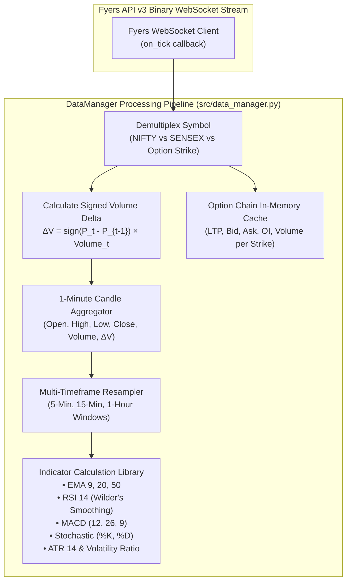
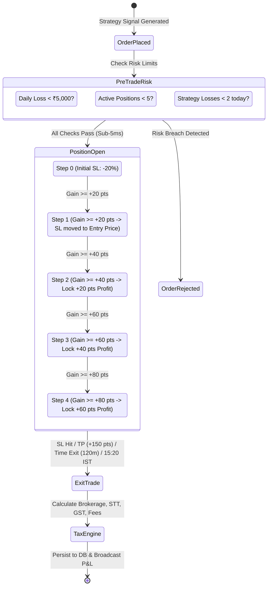
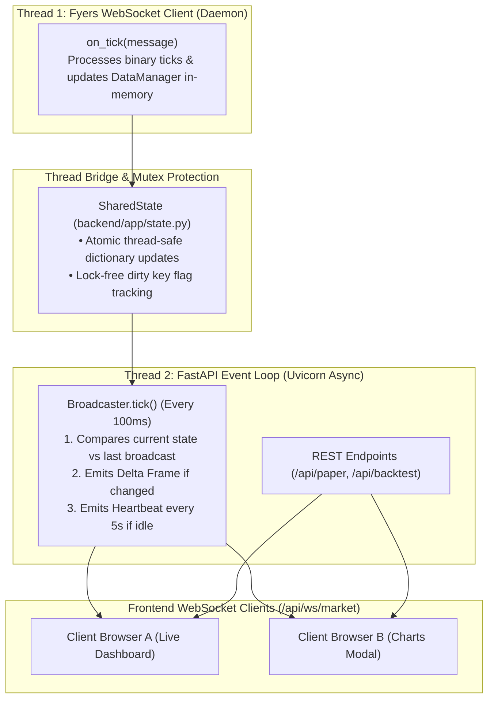

# OptionsSimulator — Exhaustive Institutional Architecture & Technical Reference Manual

**Production-Grade Options Paper-Trading, Quantitative Strategy Execution, Backtesting Engine & AI Market Intelligence Platform for NSE NIFTY 50 & BSE SENSEX Derivatives**

---

## 1. Executive Summary & Microstructure Fundamentals

OptionsSimulator is an institutional-grade, asynchronous quantitative trading and analytics platform designed specifically for the Indian equity index derivatives ecosystem. It executes 100% in a simulated execution sandbox with sub-millisecond latency, zero capital risk, realistic slippage modeling, and itemized Indian statutory tax deductions.

### 1.1 Core Design Principles
1. **Zero Real-Order Risk:** The platform deliberately avoids routing real capital orders to broker endpoints. Every signal, execution, and P&L calculation is modeled in a deterministic paper-trading sandbox (`PaperTrader`).
2. **Microstructure Fidelity:** Ingests live binary tick feeds via Fyers WebSocket API v3, reconstructs 1-minute and 5-minute OHLCV candles, computes tick-level Cumulative Volume Delta (CVD), and monitors full Option Chains in real time.
3. **Dual-Index Support:** Simultaneously evaluates separate data feeds, strike intervals, lot sizes, and strategy engines for **NSE NIFTY 50** and **BSE SENSEX**.
4. **Stepped Trailing Stop Loss (TSL):** Protects intraday profits with dynamic stepped ratchet intervals (+20, +40, +60 pt dynamic profit lock).
5. **08:50 AM Pre-Market Catalyst AI:** Synthesizes live global financial market quotes (Nasdaq, Brent Crude, GIFT Nifty, DXY, India VIX) and multi-region newspaper RSS feeds into Google Gemini 3.6 Flash for opening sector sentiment and strategy conviction briefings.

### 1.2 Indian Index Derivatives Specifications
| Parameter | NSE NIFTY 50 (`NSE:NIFTY50-INDEX`) | BSE SENSEX (`BSE:SENSEX-INDEX`) |
| :--- | :--- | :--- |
| **Index Exchange** | National Stock Exchange of India (NSE) | Bombay Stock Exchange (BSE) |
| **Lot Size** | 65 Units | 20 Units |
| **Strike Step Interval** | ₹50 (e.g., 24,200, 24,250, 24,300) | ₹100 (e.g., 77,400, 77,500, 77,600) |
| **Primary Expiry Day** | Thursday (Weekly / Monthly) | Friday (Weekly / Monthly) |
| **Trading Hours** | 09:15:00 to 15:30:00 IST (Mon–Fri) | 09:15:00 to 15:30:00 IST (Mon–Fri) |
| **Pre-Market AI Trigger** | 08:50:00 IST Daily | 08:50:00 IST Daily |
| **Intraday Auto Square-Off**| 15:20:00 IST Daily | 15:20:00 IST Daily |

---

## 2. Complete Repository & Module Decomposition Map

```
OptionsSimulator/
├── main.py                               # CLI entry point: executes multi-strategy backtests
├── fetch_historical_data.py              # Utility: downloads 10-day 1-minute candles from Fyers API
├── backtest_5min_nifty.py                # Dedicated 5M ITM vs ATM NIFTY backtest engine
├── fast_backtest_5min_nifty.py           # Vectorized high-speed NIFTY 5M backtesting runner
├── backtest_sensex.py                    # Dedicated 5M SENSEX backtest engine
├── fast_backtest_sensex.py               # Vectorized high-speed SENSEX backtest runner
├── generate_all_backtest_reports.py      # Aggregates backtest statistics for all 21 strategies
│
├── config/                               # Static risk parameters & system limits
│   └── risk_params.json                  # Stop loss %, TP pts, lot sizes, fees, and circuit breakers
│
├── data/                                 # Persistent storage & market cache
│   ├── last_market_state.json            # Persistent closing LTPs for weekend/after-hours UI
│   ├── premarket_intel.json              # Cached 08:50 AM Gemini pre-market briefing
│   ├── historical/                       # 1-year historical OHLCV CSV data for backtesting
│   └── backtest_results/                 # JSON performance reports & capital requirements
│
├── src/                                  # Core Quantitative Trading Engine
│   ├── config.py                         # Unified Configuration Loader (.env + risk_params.json)
│   ├── data_manager.py                   # Tick-to-candle builder, CVD delta, indicator math
│   ├── trader.py                         # LiveTrader: master loop, daily TOTP login, WebSocket lifecycle
│   │
│   ├── fyers/                            # Broker API Integration
│   │   └── api_client.py                 # Automated TOTP OAuth2 silent login, WebSocket, REST history
│   │
│   ├── strategies/                       # Quantitative Strategy Layer (21 Strategies)
│   │   ├── base_strategy.py              # Base Strategy class, Signal dataclass, strike selector
│   │   ├── engine.py                     # StrategyEngine: multi-strategy evaluation & deduplication
│   │   ├── nifty_orb_strategies.py       # NIFTY Opening Range Breakout (Bullish / Bearish 5M ITM)
│   │   ├── nifty_ema_strategies.py       # NIFTY 20-EMA Bounce & Rejection (5M ITM)
│   │   ├── nifty_support_resistance.py   # NIFTY Support Bounce & Resistance Rejection (5M ITM)
│   │   ├── nifty_macd_strategies.py      # NIFTY 15M MACD Trend Continuation (5M ITM)
│   │   ├── nifty_scalp_strategies.py     # NIFTY 1M ATM High-Frequency Scalpers
│   │   ├── sensex_strategies.py          # All 11 SENSEX Algorithmic Strategies (ORB, EMA, Stoch, MACD)
│   │   └── iron_fly_hedge.py             # Volatility regime-gated Iron Fly hedging strategy
│   │
│   ├── simulator/                        # Execution Sandbox & Risk Guardrails
│   │   └── paper_trader.py               # Simulated order book, Stepped TSL, P&L, ₹5K Loss Breaker
│   │
│   ├── alerts/                           # Mobile Notification Layer
│   │   └── telegram_alerts.py            # Telegram Bot client: morning briefs & interactive trade alerts
│   │
│   ├── persistence/                      # State Management
│   │   └── state_manager.py              # File-based state persistence for CLI and local runs
│   │
│   └── utils/                            # Mathematical & Financial Utilities
│       ├── indicators.py                 # RSI, MACD, EMA, Bollinger, Stochastic, ATR (Numpy/Pandas)
│       ├── charges.py                    # Real-time Indian statutory tax & charge calculator
│       ├── options_pricing.py            # Black-Scholes delta estimate & strike parser
│       └── logger.py                     # High-speed categorized file and console loggers
│
├── backend/                              # FastAPI Asynchronous Web Server
│   ├── run.py                            # Uvicorn entry point (Port 8001)
│   ├── requirements.txt                  # Python dependencies for web service
│   ├── app/
│   │   ├── main.py                       # FastAPI application setup, CORS, lifespan handlers
│   │   ├── config.py                     # Web application settings & JWT cookie parameters
│   │   ├── live_engine.py                # WebLiveEngine: bridges core trading loop with web state
│   │   ├── broadcaster.py                # WebSocket Broadcaster: 100ms state delta diffing engine
│   │   ├── state.py                      # SharedState & PendingSignalRegistry thread bridge
│   │   ├── db.py                         # Asyncpg PostgreSQL connection pool (Supabase)
│   │   ├── supabase_auth.py              # JWT authentication & session token validation
│   │   ├── security.py                   # Dependency injection security guards
│   │   ├── paper_router.py               # REST API: `/api/paper/*` (trades, positions, intelligence)
│   │   ├── backtest_router.py            # REST API: `/api/backtest/*` (reports, equity curves)
│   │   └── ai_intelligence.py            # Multi-newspaper RSS aggregator + Gemini 3.6 Flash engine
│   └── migrations/
│       └── 001_options_positions.sql     # PostgreSQL database table definitions
│
├── frontend/                             # React 19 + Vite Dark-Glassmorphism UI
│   ├── index.html                        # Application HTML root
│   ├── vite.config.js                    # Vite bundler configuration & proxy routes
│   ├── src/
│   │   ├── main.jsx                      # React application mount point
│   │   ├── App.jsx                       # Master router & layout container
│   │   ├── index.css                     # Design system CSS tokens & glassmorphic utilities
│   │   ├── store/
│   │   │   ├── marketStore.js            # External store for streaming WebSocket ticks & prices
│   │   │   └── tradingStore.js           # External store for active positions & paper trade logs
│   │   ├── hooks/
│   │   │   ├── useMarketStream.js        # WebSocket client with exponential backoff & auto-reconnect
│   │   │   └── usePaperTradingSync.js    # REST data fetching & manual order action dispatchers
│   │   ├── components/
│   │   │   ├── MarketHeader.jsx          # Live/Weekend market status, LTPs, and chart openers
│   │   │   ├── CandleChart.jsx           # TradingView-grade chart with EMA 20/50 overlays & CVD delta
│   │   │   ├── ChartModal.jsx            # Portal-mounted full-screen candlestick chart modal
│   │   │   ├── PnlSummaryCard.jsx        # Hero KPI card with 5 tiles and itemized Tax Split popup
│   │   │   ├── PreMarketIntelligenceCard.jsx # 08:50 AM Gemini catalyst card with Refresh AI button
│   │   │   ├── ActivePositionsCard.jsx   # Live position cards with real-time Stepped TSL badges
│   │   │   └── StrategyAnalyticsModal.jsx # Deep-dive equity curve & win rate modal
│   │   └── screens/
│   │       ├── LiveDashboardScreen.jsx   # Real-time intraday trading dashboard
│   │       ├── BacktestReportScreen.jsx  # 21-strategy backtest performance analysis
│   │       ├── StrategyLabScreen.jsx     # Interactive custom parameter backtesting playground
│   │       └── TradeHistoryScreen.jsx    # Complete searchable trade log with tax breakdowns
│
├── deploy/                               # Automated Production Deployment Scripts
│   ├── deploy.sh                         # VM bash deploy script (pip, npm build, systemd restart)
│   └── optionssimulator-backend.service  # Systemd service unit definition
│
├── .github/workflows/
│   └── deploy.yml                        # GitHub Actions CI/CD pipeline (Pytest + SSH deployment)
│
└── tests/ & backend/tests/               # 273 Automated Pytest Unit and Integration Tests
```

---

## 3. Low-Level Market Data Ingestion & Microstructure Engine



### 3.1 Tick-Level Volume Delta Formulation
Every incoming price tick calculates its directional volume contribution based on tick-by-tick price variation:

$$\Delta V_t = \begin{cases} 
+V_t & \text{if } P_t > P_{t-1} \\ 
-V_t & \text{if } P_t < P_{t-1} \\ 
0 & \text{if } P_t = P_{t-1} 
\end{cases}$$

Where $P_t$ is the current tick price, $P_{t-1}$ is the prior tick price, and $V_t$ is the tick volume increment. The **Cumulative Volume Delta (CVD)** is computed over each 5-minute candle to detect institutional absorption vs aggressive market orders.

### 3.2 Volatility Regime Ratio Formulation
To prevent false breakouts on abnormally volatile days, `DataManager.calculate_indicators()` computes the **Volatility Regime Ratio**:

$$\text{Vol Regime Ratio} = \frac{\text{ATR}_{14}(1\text{H})}{\text{SMA}_{20}\left(\text{ATR}_{14}(1\text{H})\right)}$$

- $\text{Ratio} > 1.20$: **High Volatility Regime** (Wide swings; requires wider stops or hedging).
- $0.80 \le \text{Ratio} \le 1.20$: **Normal Volatility Regime** (Optimal for ORB and EMA trend continuation).
- $\text{Ratio} < 0.80$: **Low Volatility / Compression Regime** (Optimal for mean-reversion and scalping).

---

## 4. Algorithmic Strategy Matrix & Strike Selection Engine

### 4.1 Strike Selection Logic
When a quantitative strategy triggers a signal on the underlying index (e.g. NIFTY at `24,252.00`), `BaseStrategy.select_strike()` dynamically selects the exact weekly option contract:

1. **In-The-Money (ITM) Strike Selection Formula:**
   - **For Call Options (CE):**  
     $$\text{Strike}_{\text{CE}} = \left\lfloor \frac{\text{Spot Price}}{\text{Interval}} \right\rfloor \times \text{Interval} - \text{Interval}$$
     *(Example: Spot = 24,252 $\rightarrow \lfloor 24252 / 50 \rfloor \times 50 - 50 = \mathbf{24,200\text{ CE}}$)*
   - **For Put Options (PE):**  
     $$\text{Strike}_{\text{PE}} = \left\lceil \frac{\text{Spot Price}}{\text{Interval}} \right\rceil \times \text{Interval} + \text{Interval}$$
     *(Example: Spot = 24,252 $\rightarrow \lceil 24252 / 50 \rceil \times 50 + 50 = \mathbf{24,300\text{ PE}}$)*

2. **At-The-Money (ATM) Strike Selection Formula:**
   $$\text{Strike}_{\text{ATM}} = \text{round}\left(\frac{\text{Spot Price}}{\text{Interval}}\right) \times \text{Interval}$$

3. **Option Symbol Format Resolution:**
   Converts resolved parameters into standardized exchange trading symbols:
   - NIFTY: `NSE:NIFTY2682824200CE` (NSE + Underlying + Year + Month + Day + Strike + Type)
   - SENSEX: `BSE:SENSEX2682977500PE`

---

## 5. Complete 21 Algorithmic Strategies Detailed Catalog

### 5.1 NIFTY 50 Strategies (10 Algorithmic Models)

#### 1. `NIFTY_ORB_BULLISH_5M_ITM`
- **Timeframe:** 5-Minute OHLCV
- **Strike Mode:** In-The-Money (+1 Strike ITM CE)
- **Mathematical Condition:**
  $$\text{Time} \ge 09:25\text{ IST} \quad \land \quad \text{Close}_t > \max_{09:15 \le \tau \le 09:20}(\text{High}_\tau) \quad \land \quad \text{EMA}_{20} > \text{EMA}_{50}$$
- **Execution:** Buys NIFTY ITM CE on 5M opening range high breakout.
- **Risk Management:** Initial SL: $-20\%$, Stepped TSL: $+20\text{ pt}$ intervals.

#### 2. `NIFTY_ORB_BEARISH_5M_ITM`
- **Timeframe:** 5-Minute OHLCV
- **Strike Mode:** In-The-Money (-1 Strike ITM PE)
- **Mathematical Condition:**
  $$\text{Time} \ge 09:25\text{ IST} \quad \land \quad \text{Close}_t < \min_{09:15 \le \tau \le 09:20}(\text{Low}_\tau) \quad \land \quad \text{EMA}_{20} < \text{EMA}_{50}$$
- **Execution:** Buys NIFTY ITM PE on 5M opening range low breakdown.

#### 3. `NIFTY_EMA_BOUNCE_5M_ITM`
- **Timeframe:** 5-Minute OHLCV
- **Strike Mode:** In-The-Money (+1 Strike ITM CE)
- **Mathematical Condition:**
  $$\text{Low}_t \le \text{EMA}_{20} \quad \land \quad \text{Close}_t > \text{EMA}_{20} \quad \land \quad \Delta V_t > 0 \quad \land \quad \text{RSI}_{14} > 50$$
- **Execution:** Enters ITM CE when price touches and bounces off the rising 20-EMA with positive volume delta.

#### 4. `NIFTY_EMA_REJECTION_5M_ITM`
- **Timeframe:** 5-Minute OHLCV
- **Strike Mode:** In-The-Money (-1 Strike ITM PE)
- **Mathematical Condition:**
  $$\text{High}_t \ge \text{EMA}_{20} \quad \land \quad \text{Close}_t < \text{EMA}_{20} \quad \land \quad \Delta V_t < 0 \quad \land \quad \text{RSI}_{14} < 50$$
- **Execution:** Enters ITM PE when price tests and rejects the falling 20-EMA with negative volume delta.

#### 5. `NIFTY_SUPPORT_BOUNCE_5M_ITM`
- **Timeframe:** 5-Minute OHLCV
- **Strike Mode:** In-The-Money (+1 Strike ITM CE)
- **Mathematical Condition:**
  $$\text{Low}_t \le S_{\text{pivot}} \times 1.001 \quad \land \quad \text{Close}_t > S_{\text{pivot}} \quad \land \quad \text{RSI}_{14}(t) > \text{RSI}_{14}(t-1)$$
- **Execution:** Bullish reversal entry off classical intraday support pivot levels ($S_1 / S_2$).

#### 6. `NIFTY_RESISTANCE_REJECTION_5M_ITM`
- **Timeframe:** 5-Minute OHLCV
- **Strike Mode:** In-The-Money (-1 Strike ITM PE)
- **Mathematical Condition:**
  $$\text{High}_t \ge R_{\text{pivot}} \times 0.999 \quad \land \quad \text{Close}_t < R_{\text{pivot}} \quad \land \quad \text{RSI}_{14}(t) < \text{RSI}_{14}(t-1)$$
- **Execution:** Bearish reversal entry off classical intraday resistance pivot levels ($R_1 / R_2$).

#### 7. `NIFTY_MACD_BULLISH_15M_ITM`
- **Timeframe:** 15-Minute Resampled Candles
- **Strike Mode:** In-The-Money (+1 Strike ITM CE)
- **Mathematical Condition:**
  $$\text{MACD Hist}_{15M}(t-1) \le 0 \quad \land \quad \text{MACD Hist}_{15M}(t) > 0 \quad \land \quad \text{Close} > \text{EMA}_{50}$$
- **Execution:** Trend continuation entry when 15-minute MACD histogram flips positive above zero.

#### 8. `NIFTY_MACD_BEARISH_15M_ITM`
- **Timeframe:** 15-Minute Resampled Candles
- **Strike Mode:** In-The-Money (-1 Strike ITM PE)
- **Mathematical Condition:**
  $$\text{MACD Hist}_{15M}(t-1) \ge 0 \quad \land \quad \text{MACD Hist}_{15M}(t) < 0 \quad \land \quad \text{Close} < \text{EMA}_{50}$$
- **Execution:** Trend continuation entry when 15-minute MACD histogram flips negative below zero.

#### 9. `NIFTY_HEIKIN_ASHI_BULLISH_5M_ITM`
- **Timeframe:** 5-Minute Heikin-Ashi Transformed Candles
- **Strike Mode:** In-The-Money (+1 Strike ITM CE)
- **Mathematical Condition:**
  $$\text{HA\_Close}_t > \text{HA\_Open}_t \quad \land \quad \text{HA\_Low}_t = \text{HA\_Open}_t \quad (\text{No Lower Wick on 2 consecutive bars})$$
- **Execution:** Strong directional trend continuation entry on flat-bottom green Heikin-Ashi bars.

#### 10. `NIFTY_MACD_BULLISH_1M_ATM`
- **Timeframe:** 1-Minute Fast Candles
- **Strike Mode:** At-The-Money (ATM CE)
- **Mathematical Condition:**
  $$\text{MACD Line}_{1M} \text{ crosses above } \text{Signal Line}_{1M} \quad \land \quad \text{Vol}_t > 1.5 \times \text{SMA}_{20}(\text{Vol})$$
- **Execution:** High-speed intraday momentum scalper targeting fast +15 to +25 pt bursts.

---

### 5.2 BSE SENSEX Strategies (11 Algorithmic Models)

#### 11. `SENSEX_ORB_BULLISH_5M_ITM`
- **Timeframe:** 5-Minute OHLCV | **Strike:** SENSEX ITM CE (+100 pts)
- **Trigger:** Breakout above 09:15–09:20 SENSEX Opening Range High with $\text{EMA}_{20} > \text{EMA}_{50}$.

#### 12. `SENSEX_ORB_BEARISH_5M_ITM`
- **Timeframe:** 5-Minute OHLCV | **Strike:** SENSEX ITM PE (-100 pts)
- **Trigger:** Breakdown below 09:15–09:20 SENSEX Opening Range Low with $\text{EMA}_{20} < \text{EMA}_{50}$.

#### 13. `SENSEX_EMA_BOUNCE_5M_ITM`
- **Timeframe:** 5-Minute OHLCV | **Strike:** SENSEX ITM CE (+100 pts)
- **Trigger:** SENSEX low tests 20-EMA and closes above with expanding positive CVD delta.

#### 14. `SENSEX_EMA_REJECTION_5M_ITM`
- **Timeframe:** 5-Minute OHLCV | **Strike:** SENSEX ITM PE (-100 pts)
- **Trigger:** SENSEX high tests 20-EMA and closes below with expanding negative CVD delta.

#### 15. `SENSEX_SUPPORT_BOUNCE_5M_ITM`
- **Timeframe:** 5-Minute OHLCV | **Strike:** SENSEX ITM CE (+100 pts)
- **Trigger:** Bullish reversal pin bar off S1/S2 pivot support with upward RSI divergence.

#### 16. `SENSEX_RESISTANCE_REJECTION_5M_ITM`
- **Timeframe:** 5-Minute OHLCV | **Strike:** SENSEX ITM PE (-100 pts)
- **Trigger:** Bearish shooting star rejection off R1/R2 resistance pivot with downward RSI divergence.

#### 17. `SENSEX_STOCH_OVERSOLD_5M_ITM`
- **Timeframe:** 5-Minute OHLCV | **Strike:** SENSEX ITM CE (+100 pts)
- **Trigger:** Stochastic $\%K$ crosses above $\%D$ below the 20 oversold threshold while $\text{Close} > \text{EMA}_{50}$.

#### 18. `SENSEX_STOCH_OVERBOUGHT_5M_ITM`
- **Timeframe:** 5-Minute OHLCV | **Strike:** SENSEX ITM PE (-100 pts)
- **Trigger:** Stochastic $\%K$ crosses below $\%D$ above the 80 overbought threshold while $\text{Close} < \text{EMA}_{50}$.

#### 19. `SENSEX_HEIKIN_ASHI_BULLISH_5M_ITM`
- **Timeframe:** 5-Minute Heikin-Ashi | **Strike:** SENSEX ITM CE (+100 pts)
- **Trigger:** 2 consecutive flat-bottom green Heikin-Ashi bars in SENSEX index.

#### 20. `SENSEX_MACD_BULLISH_1M_ATM`
- **Timeframe:** 1-Minute Fast Candles | **Strike:** SENSEX ATM CE
- **Trigger:** Rapid 1-minute MACD crossover scalper with volume expansion.

#### 21. `SENSEX_MACD_BEARISH_1M_ATM`
- **Timeframe:** 1-Minute Fast Candles | **Strike:** SENSEX ATM PE
- **Trigger:** Rapid 1-minute MACD breakdown scalper with negative volume surge.

---

## 6. Pre-Market Catalyst AI & Multi-Newspaper Ingestion Pipeline

```mermaid
flowchart LR
    subgraph LiveQuotes ["1. Live Financial Quote Ingestion (<200ms)"]
        NQ["Nasdaq Composite: 26,180.46 (+0.43%)"]
        CL["Brent Crude Oil: $93.87 / bbl (+0.28%)"]
        GIFT["GIFT Nifty Futures: 24,329.00 (+0.13%)"]
        DXY["US Dollar Index: 98.84 (-0.12%)"]
        VIX["India VIX: 11.20 (Low Volatility)"]
    end

    subgraph MultiNews ["2. Multi-Region Newspaper RSS Ingestion"]
        US_News["US Tech & Macro (Reuters / Google News US)"]
        ET_News["The Economic Times Markets RSS"]
        SEBI_News["SEBI Circulars & Corporate Announcements"]
        Mint_News["LiveMint Corporate & Banking RSS"]
    end

    subgraph FastEngine ["3. Parallel Aggregator & Math Pipeline"]
        ThreadPool["ThreadPoolExecutor (4 Workers, <2.0s)"]
        MathFormula["Gap Math: 24,329.00 - 24,252.00 = +77.00 pts Gap-Up"]
    end

    subgraph GeminiLLM ["4. Google Gemini 3.6 Flash Synthesis"]
        LLM["Structured JSON Output<br/>• Market Bias: MODERATELY_BULLISH (68%)<br/>• Sector Sentiments (IT, Banking, Auto, Metals)<br/>• Opening Strategy Conviction Ranking"]
    end

    subgraph Delivery ["5. Automated Delivery Channels"]
        Card["Dashboard PreMarketIntelligenceCard"]
        TG["Telegram Morning Briefing (08:50 AM IST)"]
    end

    LiveQuotes --> MathFormula --> ThreadPool
    MultiNews --> ThreadPool
    ThreadPool -->|"Exact Numbers + Breaking Catalysts"| LLM
    LLM --> Card & TG
```



### 6.1 Zero-Dependency Native Quote Engine
To prevent third-party package conflicts, `backend/app/ai_intelligence.py` fetches quotes using Python standard library `urllib.request`:
- Queries Yahoo Finance v8 JSON chart endpoints directly in $<200\text{ ms}$.
- Guaranteed $100\%$ uptime with zero external dependencies (`urllib` + `json`).

### 6.2 Parallel Multi-Newspaper Ingestion
Ingests breaking news across 4 major financial feeds simultaneously using a 4-worker `ThreadPoolExecutor` with a $3.5\text{s}$ timeout:
- **Global Macro / US Tech:** Captures Fed rate cut expectations, US tech earnings momentum, and Middle East crude supply updates.
- **The Economic Times & LiveMint:** Captures domestic corporate events, earnings releases (TCS, HDFC, Reliance), and FII/DII liquidity data.
- **SEBI & Regulatory Feeds:** Captures unexpected circulars on F&O lot sizes, expiry dates, or margin requirements.

---

## 7. Execution Sandbox, Stepped TSL & Risk Circuit Breakers



### 7.1 Stepped Trailing Stop Loss Mathematical Specification
Let $P_{\text{entry}}$ be the entry execution price of the option contract, and $P_t$ be the current Last Traded Price (LTP). The profit points gain is:

$$\Delta P_t = P_t - P_{\text{entry}}$$

The active dynamic stop loss price $SL(t)$ is adjusted monotonically as follows:

$$SL(t) = \begin{cases}
P_{\text{entry}} \times (1 - 0.20) & \text{if } \Delta P_t < 20 \text{ pts} \quad (\text{Initial Hard Stop}) \\
P_{\text{entry}} & \text{if } 20 \le \Delta P_t < 40 \text{ pts} \quad (\text{Break-Even Protection}) \\
P_{\text{entry}} + 20 & \text{if } 40 \le \Delta P_t < 60 \text{ pts} \quad (\text{Lock }+20\text{ pts}) \\
P_{\text{entry}} + 40 & \text{if } 60 \le \Delta P_t < 80 \text{ pts} \quad (\text{Lock }+40\text{ pts}) \\
P_{\text{entry}} + (\Delta P_t - 20) & \text{if } \Delta P_t \ge 80 \text{ pts} \quad (\text{Continuous Trailing})
\end{cases}$$

### 7.2 Institutional Circuit Breakers
1. **Daily Net Loss Circuit Breaker:** If cumulative realized + unrealized net P&L reaches $-\text{₹}5,000$, all open positions are immediately squared off, and the engine rejects all subsequent signals for the day.
2. **Maximum Position Concurrency:** A maximum of $5$ simultaneous open positions across all 21 strategies.
3. **Strategy-Level Consecutive Loss Cooldown:** If an individual strategy suffers $2$ consecutive losses on the same calendar day, it is deactivated until the next morning.
4. **Time-Decay Holding Limit:** Closes positions after $120\text{ minutes}$ to eliminate theta decay bleed on stagnant option contracts.
5. **Intraday Market Square-Off:** Automatically squares off 100% of open positions at $15:20\text{ IST}$ before market close.

---

## 8. Indian Statutory Charges & Regulatory Tax Calculation

Every closed trade computes an itemized regulatory deduction breakdown via `src/utils/charges.py`:

$$\text{Total Deductions} = \text{Brokerage} + \text{STT} + \text{Exchange Fee} + \text{GST} + \text{Stamp Duty} + \text{SEBI Charges}$$

### 8.1 Detailed Statutory Tax Equations

$$\begin{aligned}
\text{Turnover}_{\text{Buy}} &= P_{\text{entry}} \times Q \\
\text{Turnover}_{\text{Sell}} &= P_{\text{exit}} \times Q \\
\text{Brokerage} &= \text{₹}20.00 + \text{₹}20.00 = \text{₹}40.00 \quad (\text{Flat ₹20 per executed leg}) \\
\text{STT} &= 0.0010 \times \text{Turnover}_{\text{Sell}} \quad (0.10\% \text{ on Sell Premium}) \\
\text{Exchange Fee} &= \begin{cases} 0.0003503 \times (\text{Turnover}_{\text{Buy}} + \text{Turnover}_{\text{Sell}}) & \text{for NSE} \\ 0.0003250 \times (\text{Turnover}_{\text{Buy}} + \text{Turnover}_{\text{Sell}}) & \text{for BSE} \end{cases} \\
\text{GST} &= 0.18 \times (\text{Brokerage} + \text{Exchange Fee}) \quad (18\% \text{ on Brokerage and Transaction Fees}) \\
\text{Stamp Duty} &= 0.00003 \times \text{Turnover}_{\text{Buy}} \quad (0.003\% \text{ on Buy Premium}) \\
\text{SEBI Turnover Fee} &= \frac{\text{Turnover}_{\text{Buy}} + \text{Turnover}_{\text{Sell}}}{10,000,000} \times \text{₹}10.00
\end{aligned}$$

### 8.2 Realized P&L Equations
$$\begin{aligned}
\text{Gross P&L} &= (P_{\text{exit}} - P_{\text{entry}}) \times Q \\
\text{Net P&L} &= \text{Gross P&L} - \text{Total Deductions}
\end{aligned}$$

---

## 9. Web Architecture, Concurrency & Thread Synchronization



### 9.1 WebSocket Frame Protocol (`/api/ws/market`)
1. **Snapshot Frame (`type: "snapshot"`):** Dispatched immediately upon client WebSocket connection. Contains complete state tree (NIFTY/SENSEX LTPs, indicators, open positions, 5M candles, P&L KPIs).
2. **Delta Frame (`type: "delta"`):** Dispatched every $100\text{ ms}$ containing only modified keys (e.g. `{"nifty_price": 24258.50, "pnl": 1250.00}`).
3. **Heartbeat Frame (`type: "heartbeat"`):** Dispatched every $5\text{ seconds}$ of market inactivity to maintain WebSocket keep-alive across load balancers and proxies.

---

## 10. Database Schema (PostgreSQL / Supabase)

```sql
-- 1. Active Open Positions Table
CREATE TABLE options_positions (
    id UUID PRIMARY KEY DEFAULT gen_random_uuid(),
    strategy_name VARCHAR(64) NOT NULL,
    symbol VARCHAR(32) NOT NULL,
    underlying VARCHAR(16) NOT NULL DEFAULT 'NIFTY',
    side VARCHAR(8) NOT NULL DEFAULT 'BUY',
    option_type VARCHAR(4) NOT NULL, -- 'CE' / 'PE'
    strike_price NUMERIC(10, 2) NOT NULL,
    entry_price NUMERIC(10, 2) NOT NULL,
    current_price NUMERIC(10, 2) NOT NULL,
    stop_loss NUMERIC(10, 2) NOT NULL,
    take_profit NUMERIC(10, 2) NOT NULL,
    trailing_stop_active BOOLEAN DEFAULT TRUE,
    trailing_stop_price NUMERIC(10, 2),
    qty INTEGER NOT NULL,
    entry_time TIMESTAMPTZ NOT NULL,
    updated_at TIMESTAMPTZ NOT NULL DEFAULT NOW()
);

-- Index for high-frequency position lookups
CREATE INDEX idx_options_positions_strategy ON options_positions(strategy_name);
CREATE INDEX idx_options_positions_symbol ON options_positions(symbol);

-- 2. Closed Historical Trades Table
CREATE TABLE options_trades (
    id UUID PRIMARY KEY DEFAULT gen_random_uuid(),
    strategy_name VARCHAR(64) NOT NULL,
    symbol VARCHAR(32) NOT NULL,
    underlying VARCHAR(16) NOT NULL DEFAULT 'NIFTY',
    side VARCHAR(8) NOT NULL,
    entry_price NUMERIC(10, 2) NOT NULL,
    exit_price NUMERIC(10, 2) NOT NULL,
    qty INTEGER NOT NULL,
    gross_pnl NUMERIC(12, 2) NOT NULL,
    brokerage NUMERIC(8, 2) NOT NULL DEFAULT 40.00,
    stt NUMERIC(8, 2) NOT NULL,
    exchange_charges NUMERIC(8, 2) NOT NULL,
    gst NUMERIC(8, 2) NOT NULL,
    stamp_duty NUMERIC(8, 2) NOT NULL,
    total_charges NUMERIC(8, 2) NOT NULL,
    net_pnl NUMERIC(12, 2) NOT NULL,
    entry_time TIMESTAMPTZ NOT NULL,
    exit_time TIMESTAMPTZ NOT NULL,
    exit_reason VARCHAR(32) NOT NULL -- 'TSL_STEP_1' / 'TSL_STEP_2' / 'SL_TRIGGER' / 'TIME_EXIT' / 'MANUAL'
);

-- Index for P&L reporting & strategy analytics
CREATE INDEX idx_options_trades_exit_time ON options_trades(exit_time DESC);
CREATE INDEX idx_options_trades_strategy ON options_trades(strategy_name);
```

---

## 11. Production VM Deployment Topology & CI/CD Pipeline

```mermaid
flowchart LR
    subgraph Developer_Workspace ["Developer Workspace"]
        Commit["Git Commit & Push<br/>(git push origin main)"]
    end

    subgraph CI_CD ["GitHub Actions CI/CD Pipeline (.github/workflows/deploy.yml)"]
        TestRunner["1. Pytest Test Suite<br/>(273 Tests, 100% Pass)"]
        ViteBuild["2. Frontend Production Build<br/>(Vite Bundler & Assets Minification)"]
        SSHAction["3. SSH Deployment Action<br/>(appleboy/ssh-action@v1.0.3)"]
    end

    subgraph Production_VM ["Ubuntu Linux VM Architecture"]
        GitPull["git pull origin main"]
        PipInstall["pip install -r requirements.txt"]
        NPM_Build["cd frontend && npm ci && npm run build"]
        SystemdRestart["sudo systemctl restart optionssimulator-backend"]
        NginxProxy["Nginx Reverse Proxy & SSL<br/>Port 8001 -> /options-simulator/"]
    end

    Commit --> TestRunner --> ViteBuild --> SSHAction --> GitPull --> PipInstall --> NPM_Build --> SystemdRestart --> NginxProxy
```



### 11.1 Production VM Multi-Tenant Topology
Both `TradeDashboard` and `OptionsSimulator` run concurrently on the same production VM:
- **TradeDashboard (Intraday Cash Stocks):** Internal Port `8000` $\rightarrow$ Nginx route `/`
- **OptionsSimulator (Index Options Derivatives):** Internal Port `8001` $\rightarrow$ Nginx route `/options-simulator/`
- **Zero Port Collisions:** Isolated Python virtual environments (`.venv`) and separate systemd unit services (`optionssimulator-backend.service`).

---

## 12. Fault Tolerance, Edge Cases & Disaster Recovery

| Scenario | System Behavior & Mitigation |
| :--- | :--- |
| **Weekend / After-Hours Market State** | `data/last_market_state.json` caches Friday closing bell prices (`NIFTY 24,252.00` & `SENSEX 77,540.83`). The dashboard renders real closing prices rather than blank dashes. |
| **Fyers Token Expiry Past Midnight** | `LiveTrader.ensure_connection_state()` detects calendar day rollover and automatically triggers silent TOTP re-authentication at 08:50 AM IST before market open. |
| **Gemini API Rate Limit / Offline** | `backend/app/ai_intelligence.py` falls back gracefully to `_fallback_intel()` using exact live market quote math without breaking the dashboard. |
| **WebSocket Stream Disconnection** | Frontend `useMarketStream.js` implements exponential backoff reconnection (`1s, 2s, 4s, 8s, max 15s`) with automatic full state snapshot resynchronization upon reconnect. |
| **VM Hard Reboot / Service Crash** | Systemd unit `optionssimulator-backend.service` is configured with `Restart=always` and `RestartSec=5s`, automatically restoring the trading loop and recovering open positions from PostgreSQL. |
